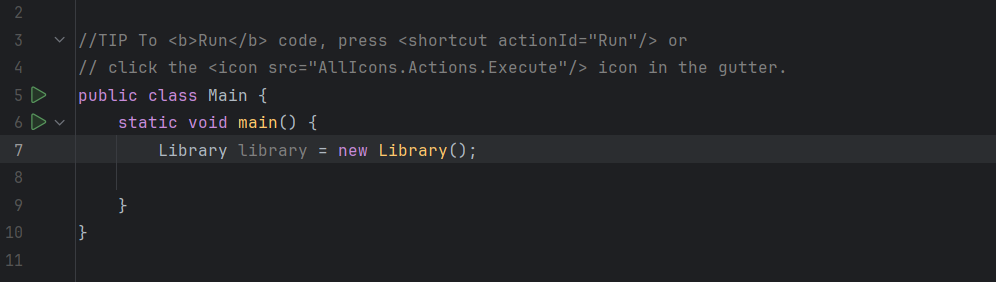
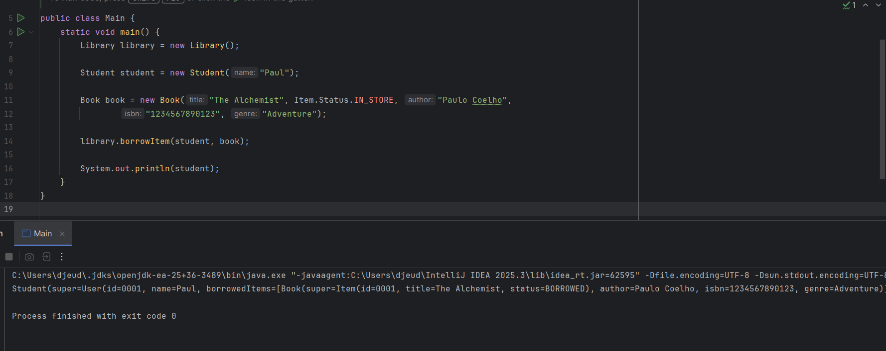
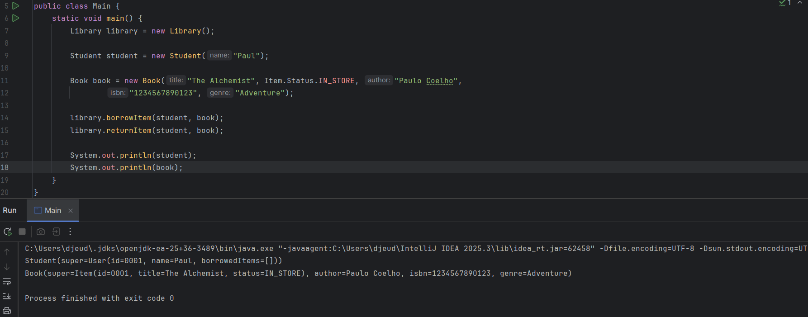
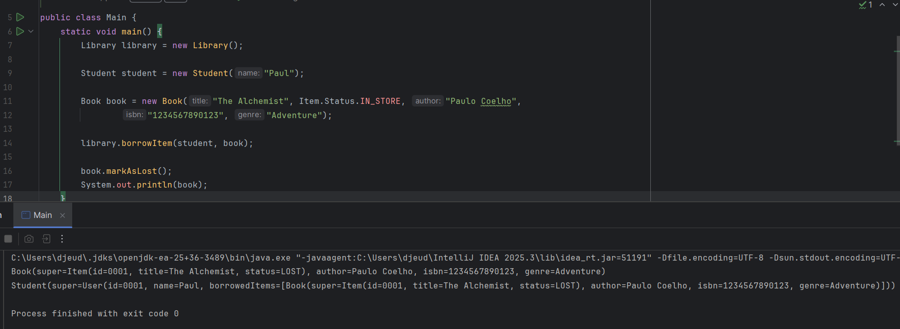
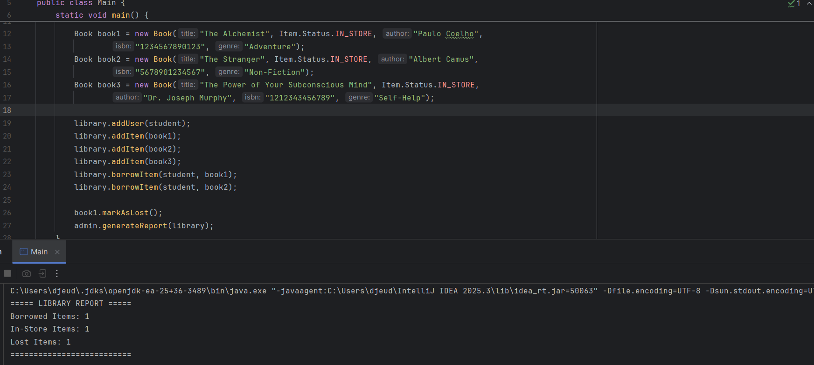
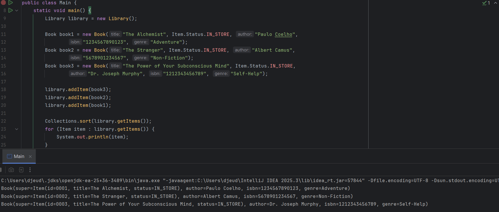
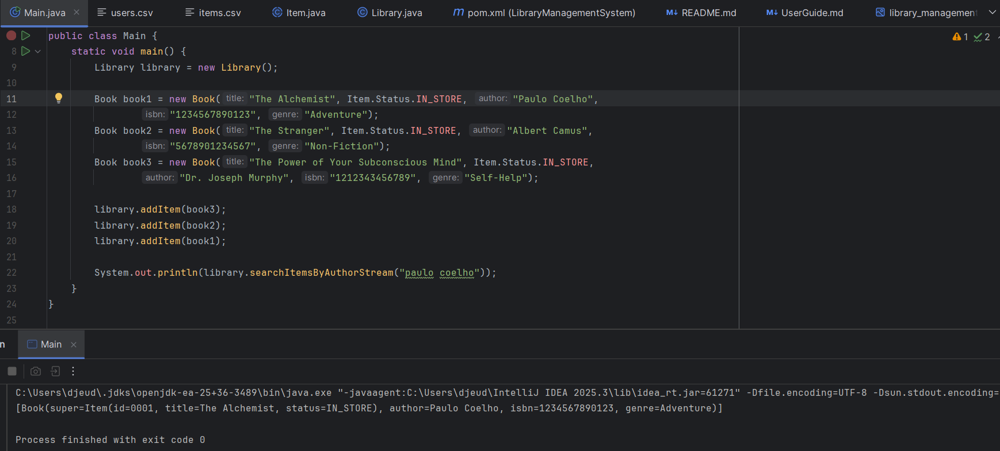
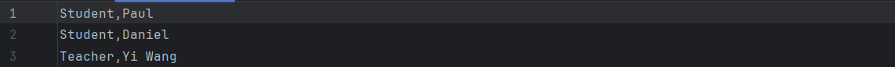
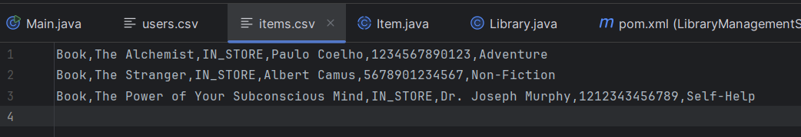

# Library Management System — User Guide
---

## User Roles

### Student
- Can borrow items within a borrowing limit
- Can return borrowed items

### Teacher
- Can borrow items (typically with higher limits)
- Can return items

### Admin
- Can generate system reports
- Can view overall library statistics

---

## Library Items

### 📘 Book
- Title
- Author
- ISBN
- Genre
- Status (IN_STORE, BORROWED, LOST)

### 📀 DVD
- Title
- Director
- Duration
- Status

### 📰 Magazine
- Title
- Publisher
- Issue number
- Status

---

## How to Run the Project

### Step 1: Open the project
Open the project in an IDE such as IntelliJ IDEA.

### Step 2: Initialize the system
The system starts by creating a Library instance in the Main class:

---

## Borrowing Items

## How it works:
1. Create and/or select a user
2. Create and/or select an available item
3. Borrow the item through the system

### Conditions:
- Item must be available (IN_STORE)
- User must not exceed borrowing limit
- Item must not be null

### Result:
- Item status changes to BORROWED
- Item is added to the user’s borrowed list

---

## Returning Items

### How it works:
1. Select the user
2. Select the borrowed item
3. Return the item through the system

### Conditions:
- Item must be currently borrowed
- Item must belong to the user

### Result:
- Item status changes back to IN_STORE
- Item is removed from user's borrowed list

---

## Lost Items

- Borrowed items can be marked as LOST
- Only BORROWED items can be reported lost
- Lost items are no longer available for borrowing

---

## Reports (Admin Feature)

Admins can generate a report showing:
- Number of borrowed items
- Number of available items
- Number of lost items

This provides a snapshot of the library’s current state.

---

## Sorting System

The system supports multiple sorting strategies:

### Default Sorting (Comparable)
- Items sorted by ID
- Users sorted by ID

### Alternative Sorting (Comparator)
- Items sorted by title
- Users sorted by name

Sorting is applied when displaying or organizing data.

---

## Searching Items

- Items can be searched by author or by title, recursively or by stream

### Steps

- Create and add users & items to the library
- Call one of the four following methods:
1. searchItemsByTitleRecursive()
2. searchItemsByAuthorRecursive()
3. searchItemsByTitleStream()
4. searchItemsByAuthorStream()

--- 

## Data Persistence

The system uses CSV files for storage:

### Files:
- `items.csv`
- `users.csv`

### Behaviour:
- Data is loaded at startup
- Data is saved after changes (backup)

### Steps

- Initialize library
- Create and add users & items to the library
- At the end of the interactions, backup the users and items to the csv files

---